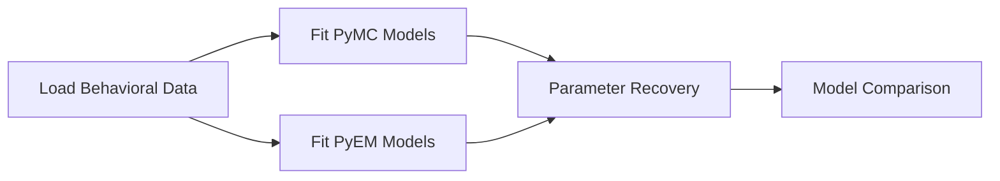
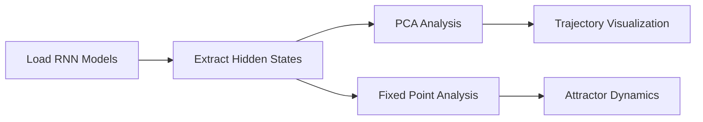

# NN4Psych Complete Analysis Pipeline & Workflows

**Last Updated:** 2025-11-19
**Version:** v3.0
**Project:** Neural Networks for Psychological Modeling (Reorganized)

---

## 🎯 Complete Analysis Capabilities Overview

This document provides a comprehensive guide to ALL analysis capabilities in the nn4psych project after reorganization. The pipeline supports end-to-end workflows from model training through behavioral analysis, Bayesian fitting, and advanced neural dynamics analysis.

---

## 📊 Analysis Pipeline Workflows

### Workflow 1: Complete RNN Training & Analysis


### Workflow 2: Bayesian Model Fitting


### Workflow 3: Neural Dynamics Analysis


---

## 🚀 Pipeline 1: RNN Model Training

### Step 1.1: Configuration-Based Training
**Script:** `scripts/training/examples/train_example.py`

```python
from nn4psych.training.configs import ExperimentConfig
from nn4psych.models import ActorCritic
from envs import PIE_CP_OB_v2

# Load config
config = ExperimentConfig.from_yaml('configs/experiment.yaml')

# Create model and environment
model = ActorCritic.from_config(config.model)
env = PIE_CP_OB_v2.from_config(config.task)

# Train (example usage)
python scripts/training/examples/train_example.py --config configs/experiment.yaml
```

### Step 1.2: Canonical Training with All Parameters
**Script:** `scripts/training/train_rnn_canonical.py`

```bash
# Full training with all hyperparameters
python scripts/training/train_rnn_canonical.py \
    --rollout 100 \
    --gamma 0.95 \
    --preset 0.01 \
    --scale 1.0 \
    --epochs 50000 \
    --hidden_dim 64 \
    --condition change-point \
    --seed 42
```

**Output:** Model saved as `{loss}_V3_{gamma}g_{preset}rm_{rollout}bz_{scale}tds_{hidden}n_{epochs}e.pth`

### Step 1.3: Hyperparameter Sweep (SLURM)
**Script:** `scripts/slurm_seeds.sh`

```bash
# Launch parameter sweep on HPC cluster
sbatch scripts/slurm_seeds.sh
```

Sweeps across:
- Gamma: [0.1, 0.25, 0.5, 0.7, 0.8, 0.9, 0.95, 0.99]
- Rollout: [5, 10, 20, 30, 50, 75, 100, 150, 200]
- Preset: [0.0, 0.01, 0.05, 0.1, 0.25, 0.5, 0.75, 1.0]
- Scale: [0.25, 0.5, 0.75, 1.0, 1.25, 1.5]
- Seeds: Multiple per configuration

---

## 📈 Pipeline 2: Behavioral Data Processing

### Master Pipeline Runner
**Script:** `scripts/data_pipeline/00_run_full_pipeline.py`

```bash
# Run complete pipeline (stages 1-3)
python scripts/data_pipeline/00_run_full_pipeline.py

# Run specific stages
python scripts/data_pipeline/00_run_full_pipeline.py --start 2 --end 3

# List available stages
python scripts/data_pipeline/00_run_full_pipeline.py --list
```

### Stage 01: Behavior Extraction
**Script:** `scripts/data_pipeline/01_extract_model_behavior.py`

```python
# Processes all .pth files in model directories
# Runs models through both CP and OB conditions
# Extracts:
- bucket_position (agent predictions)
- bag_position (true positions)
- helicopter_position (hidden state)
- hazard_triggers (change points)
- prediction_errors (signed & absolute)

# Output:
- output/behavioral_summary/task_trials_long.csv
- output/behavioral_summary/raw_behavior_data.pickle
```

### Stage 02: Learning Metrics Computation
**Script:** `scripts/data_pipeline/02_compute_learning_metrics.py`

```python
# Computes:
- Learning rate = update / prediction_error (clipped [0,1])
- Filters by prediction error threshold (>20)
- Aggregates by model, condition, epoch

# Output:
- output/behavioral_summary/learning_rates_by_condition.csv
- output/behavioral_summary/summary_performance_metrics.csv
```

### Stage 03: Hyperparameter Analysis
**Script:** `scripts/data_pipeline/03_analyze_hyperparameter_sweeps.py`

```python
# Parses model filenames for hyperparameters
# Aggregates performance by parameter value
# Generates trend analysis

# Output:
- output/parameter_exploration/gamma_sweep_results.csv
- output/parameter_exploration/rollout_sweep_results.csv
- output/parameter_exploration/preset_sweep_results.csv
- output/parameter_exploration/scale_sweep_results.csv
```

---

## 🔬 Pipeline 3: Advanced Analysis Scripts

### Unified Hyperparameter Analysis
**Script:** `scripts/analysis/analyze_hyperparams_unified.py`

```bash
# Analyze specific parameter effects
python scripts/analysis/analyze_hyperparams_unified.py \
    --param gamma \
    --model_dir trained_models/checkpoints/ \
    --epochs 1000 \
    --threshold 20 \
    --output_dir output/
```

Supports: gamma, rollout, preset, scale

### Refactored RNN Analysis
**Script:** `scripts/analysis/analyze_rnn_refactored.py`

```python
# Complete behavioral analysis
# Generates all standard plots
# Uses modular nn4psych package

python scripts/analysis/analyze_rnn_refactored.py \
    --model_path trained_models/best_models/model.pth \
    --output_dir figures/
```

### Learning Rate Visualizations
**Script:** `scripts/analysis/visualize_learning_rates.py`

```python
# Creates comprehensive visualizations:
- Learning rate vs prediction error curves
- Distribution histograms by condition
- Interaction plots
- Before/after hazard comparisons

# Output: figures/behavioral_summary/
```

### Nassar Figure 6 Reproduction
**Script:** `scripts/analysis/nassarfig6.py`

```python
# Reproduces key figures from Nassar et al. 2021
# Compares RNN behavior to human data
# Generates publication-quality plots

python scripts/analysis/nassarfig6.py \
    --human_data data/raw/nassar2021/ \
    --model_data output/behavioral_summary/
```

### Fixed Point Analysis
**Script:** `scripts/analysis/analyze_fixed_points.py`

```python
# Advanced neural dynamics analysis
# Finds fixed points in RNN state space
# Analyzes attractor dynamics

python scripts/analysis/analyze_fixed_points.py \
    --model_path trained_models/best_models/model.pth \
    --n_samples 1000
```

---

## 🧮 Pipeline 4: Bayesian Model Fitting

### PyMC Bayesian Fitting
**Script:** `scripts/fitting/fit_bayesian_pymc.py`

```python
# Fit normative Bayesian models using PyMC
# Methods: MLE, MCMC, Variational Inference

python scripts/fitting/fit_bayesian_pymc.py \
    --data output/behavioral_summary/task_trials_long.csv \
    --method mcmc \
    --samples 10000 \
    --chains 4

# Parameters estimated:
- H: Hazard rate
- σ_motor: Motor noise
- σ_LR: Learning rate slope
```

### PyEM Framework Fitting
**Script:** `scripts/fitting/fit_bayesian_pyem.py`

```python
# Fit using PyEM framework (Loosen et al. 2023)
# Optimization: Nelder-Mead with 10,000 iterations

python scripts/fitting/fit_bayesian_pyem.py \
    --data output/behavioral_summary/task_trials_long.csv \
    --n_iter 10000 \
    --output output/bayesian_fits/

# 5 Parameters:
- H: Hazard rate
- LW: Likelihood weight
- UU: Uncertainty underestimation
- σ_motor: Motor noise
- σ_LR: Learning rate slope

# Output:
- Parameter estimates
- Model diagnostics
- Comparison plots
```

### Bayesian Model Classes
**Location:** `scripts/analysis/bayesian/`

```python
from scripts.analysis.bayesian.bayesian_models import BayesianModel
from scripts.analysis.bayesian.pyem_models import PyEMModel

# Core implementations:
- Normative model equations
- Likelihood computations
- Parameter transformations
- Prior distributions
```

---

## 📊 Pipeline 5: PCA & Visualization

### PCA Analysis Notebooks
**Location:** `notebooks/exploratory/`

1. **plot_pca.ipynb** - Standard PCA of hidden states
2. **plot_pca_contextual.ipynb** - Context-specific PCA
3. **plot_pca_helicopter.ipynb** - Task-specific visualization

```python
# Example usage in notebook:
from nn4psych.utils.io import load_model
from nn4psych.analysis.behavior import extract_behavior

model = load_model('model.pth')
states = extract_behavior(model, env, epochs=100)

# PCA analysis
from sklearn.decomposition import PCA
pca = PCA(n_components=3)
transformed = pca.fit_transform(states)
```

Output animations:
- `plots/pca_trajectories.mp4`
- `plots/pca_trajectories_3d.mp4`
- `plots/pca_trajectories_contextual.mp4`

---

## 🧪 Pipeline 6: Validation & Testing

### Unit Tests
**Location:** `tests/`

```bash
# Run all unit tests
pytest tests/

# Specific test modules
pytest tests/test_models.py
pytest tests/test_environments.py
pytest tests/test_utils.py

# With coverage
pytest --cov=nn4psych --cov-report=html
```

### Parameter Recovery Tests
**Script:** `validation/test_parameter_recovery.py`

```bash
# Test parameter recovery for Bayesian models
python validation/test_parameter_recovery.py \
    --n_simulations 100 \
    --model_type pyem
```

### Integration Tests
**Script:** `validation/test_pipeline_integration.py`

```python
# Tests complete pipeline integration
# Verifies data flow between stages
# Checks output consistency
```

---

## 📁 Data Organization

### Input Data Structure
```
data/
├── raw/                     # Immutable source data
│   ├── nassar2021/         # Human behavioral data
│   └── fig2_values/        # Reference values
├── processed/              # Processed datasets
│   ├── rnn_behavior/
│   └── bayesian_fits/
└── intermediate/           # Temporary computations
    ├── activity.npy
    ├── history.npy
    └── weights.npy
```

### Output Structure
```
output/
├── behavioral_summary/
│   ├── task_trials_long.csv
│   ├── learning_rates_by_condition.csv
│   └── summary_performance_metrics.csv
├── model_performance/
│   └── hyperparameter_aggregations.csv
├── parameter_exploration/
│   ├── {param}_sweep_results.csv
│   └── best_configurations.csv
└── bayesian_fits/
    ├── parameter_estimates.csv
    └── model_diagnostics/
```

### Figure Organization
```
figures/
├── behavioral_summary/
│   ├── learning_curves/
│   ├── distributions/
│   └── comparisons/
├── model_performance/
│   └── hyperparameter_effects/
├── parameter_exploration/
│   └── sweep_visualizations/
└── neural_dynamics/
    ├── pca_projections/
    └── fixed_points/
```

---

## 🔧 Configuration System

### Central Configuration
**File:** `config.py`

```python
# Key sections:
MODEL_PARAMS = {
    'input_dim': 9,
    'hidden_dim': 64,
    'action_dim': 3,
    'gain': 1.5
}

TASK_PARAMS = {
    'max_time': 200,
    'hazard_rate': 0.125,
    'reward_size': 5.0
}

TRAINING_PARAMS = {
    'learning_rate': 3e-4,
    'gamma': 0.95,
    'rollout_size': 100
}

# Hyperparameter sweep ranges
GAMMA_VALUES = [0.1, 0.25, 0.5, 0.7, 0.8, 0.9, 0.95, 0.99]
ROLLOUT_VALUES = [5, 10, 20, 30, 50, 75, 100, 150, 200]
PRESET_VALUES = [0.0, 0.01, 0.05, 0.1, 0.25, 0.5, 0.75, 1.0]
SCALE_VALUES = [0.25, 0.5, 0.75, 1.0, 1.25, 1.5]
```

### YAML Configuration
**Example:** `configs/experiment.yaml`

```yaml
model:
  type: ActorCritic
  input_dim: 9
  hidden_dim: 64
  action_dim: 3
  gain: 1.5

task:
  type: PIE_CP_OB_v2
  condition: change-point
  max_time: 200
  hazard_rate: 0.125

training:
  epochs: 50000
  learning_rate: 0.0003
  gamma: 0.95
  rollout_size: 100
  seed: 42
```

---

## 🚦 Quick Start Commands

### 1. Install Package
```bash
pip install -e .
pip install -e ".[dev,bayesian]"  # With optional dependencies
```

### 2. Train a Model
```bash
python scripts/training/train_rnn_canonical.py --gamma 0.95 --epochs 10000
```

### 3. Run Full Analysis Pipeline
```bash
python scripts/data_pipeline/00_run_full_pipeline.py
```

### 4. Fit Bayesian Models
```bash
python scripts/fitting/fit_bayesian_pyem.py --data output/behavioral_summary/task_trials_long.csv
```

### 5. Generate Visualizations
```bash
python scripts/analysis/visualize_learning_rates.py
```

### 6. Run Tests
```bash
pytest tests/ -v
```

---

## ✅ Reorganization Validation Checklist

### Import Structure
- [ ] nn4psych package imports correctly
- [ ] Standalone envs module accessible
- [ ] Bayesian models in scripts importable
- [ ] Utils functions available

### Data Pipeline
- [ ] Stage 01 extracts behavior correctly
- [ ] Stage 02 computes metrics accurately
- [ ] Stage 03 analyzes hyperparameters
- [ ] Master runner executes all stages

### Model Training
- [ ] Config-based training works
- [ ] Canonical training script runs
- [ ] Hyperparameter sweeps function
- [ ] Models save with correct naming

### Analysis Scripts
- [ ] Unified hyperparameter analysis works
- [ ] RNN analysis generates plots
- [ ] Nassar figure reproduction accurate
- [ ] Fixed point analysis runs

### Bayesian Fitting
- [ ] PyMC fitting converges
- [ ] PyEM optimization completes
- [ ] Parameter recovery validated
- [ ] Model comparison works

### Testing
- [ ] Unit tests pass
- [ ] Integration tests pass
- [ ] Parameter recovery validated
- [ ] Coverage meets threshold

---

## 🐛 Common Issues & Solutions

### ModuleNotFoundError: nn4psych
```bash
# Solution: Install package in editable mode
pip install -e .
```

### Missing Environment: PIE_CP_OB_v2
```bash
# Solution: Import from top-level envs
from envs import PIE_CP_OB_v2
```

### Bayesian Model Import Error
```python
# Solution: Add scripts to path or use absolute imports
import sys
sys.path.append('scripts/analysis')
from bayesian.bayesian_models import BayesianModel
```

### Empty Output Files
```bash
# Solution: Check model compatibility and file formats
# Verify config.py paths are correct
```

---

## 📚 References

- Nassar et al. (2021) - Predictive inference paradigms
- Wang et al. (2018) - Actor-critic RNN foundations
- Loosen et al. (2023) - PyEM framework
- Data Analysis Project Standards v2.0

---

## 📝 Next Development Steps

1. **Automated CI/CD Pipeline**: GitHub Actions for testing
2. **Docker Container**: Reproducible environment
3. **Documentation Website**: Sphinx/MkDocs
4. **Interactive Dashboard**: Streamlit/Dash for results
5. **Cloud Training**: AWS/GCP integration
6. **Model Registry**: MLflow/Weights & Biases

---

**Last Validated:** 2025-11-19
**Maintainer:** NN4Psych Team
**Status:** ✅ Reorganization Complete